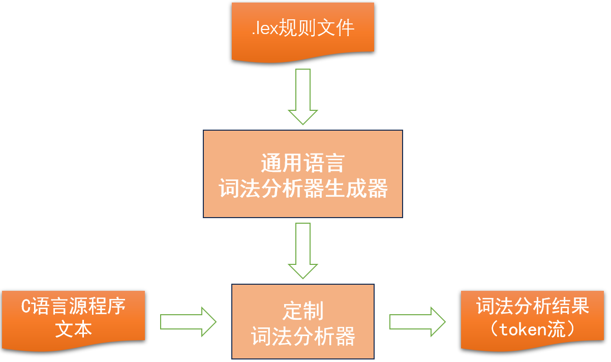
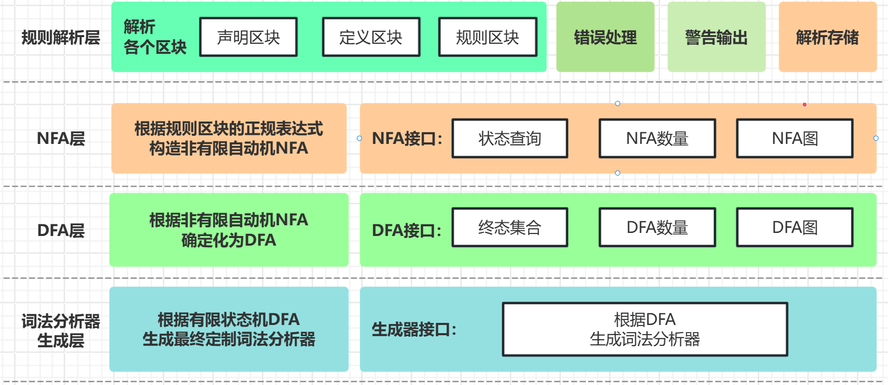
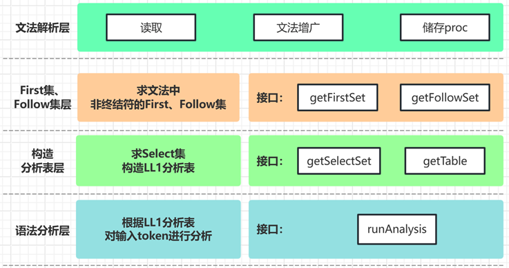

# C语言子集词法与语法分析器

本项目包含**词法分析器**与**语法分析器**两个模块，使用一个 `sh` 脚本整合，能够对 C 语言子集的代码进行词法和语法分析。该项目的实验报告和相关文档均已提供，供参考使用。

## 目录结构

- `assets/`: 存放 `README` 中引用的图像或其他资源文件。
- `docs/`: 文档目录，包含实验报告等相关文档。
- `examples/`: 示例目录，包含程序运行后的输出示例文件。
- `src/`: 源代码目录，包含词法分析器和语法分析器的实现。
    - `Lexer/`: 词法分析器相关代码目录。
    - `Grammer/`: 语法分析器相关代码目录。
    - `testCode/`: 测试代码目录，包含实验中用到的测试代码。
- `README.md`: 项目说明文件，介绍实验目的、内容及运行方式。

## 功能简介

### 1. 词法分析器

词法分析器的主要功能是从 `.lex` 文件中读取规则并生成词法分析器源代码。具体功能包括：



- 读取并解析 `.lex` 文件，识别并提取各个区块内容（包括正规表达式）。
- 能够处理 `.lex` 文件的语法规则，确保正确解析区块。
- 错误处理：对 `.lex` 文件中的错误规则进行错误提示（包括错误位置和原因）。
- 生成非确定有限自动机（NFA），并将 NFA 确定化为 DFA。
- 根据 DFA 生成词法分析器源代码。
- 运行词法分析器，展示词串并输出分析结果到文件 `token`。




### 2. 语法分析器

语法分析器的主要功能是解析输入的文法文件并进行语法分析，具体功能包括：

- 读取并解析文法文件。
- 计算文法的 `FIRST` 集和 `FOLLOW` 集。
- 计算文法的 `SELECT` 集并构造 `LL(1)` 分析表。
- 基于分析表，对输入的 `token` 流进行语法分析。
- 输出语法分析表并展示语法分析过程。
- 对语法错误进行定位并输出错误位置。



## 系统要求

- 操作系统：Linux
- 编译器：支持 C11 标准的编译器（如 `gcc`）

## 运行方式

1. 克隆或下载本项目至本地：

```bash
git clone https://github.com/fengwm64/C_Lexer_Grammer.git
```

2. 进入项目目录：

```bash
cd C_Lexer_Grammer
```

3. 运行脚本 `run.sh` 来生成并执行词法分析器和语法分析器：

```bash
./run.sh
```

词法分析器会根据输入的 `.lex` 文件生成 `token` 文件，语法分析器会对该 `token` 文件进行解析并输出分析结果。

## 实验报告

实验报告详细描述了项目的设计思路和实现过程，已作为 `PDF` 文件放置于 `docs/` 目录中。该报告仅供参考，请勿直接使用或提交作业。

**水印提示： 报告仅供参考，禁止抄袭和用于直接提交作业！**
